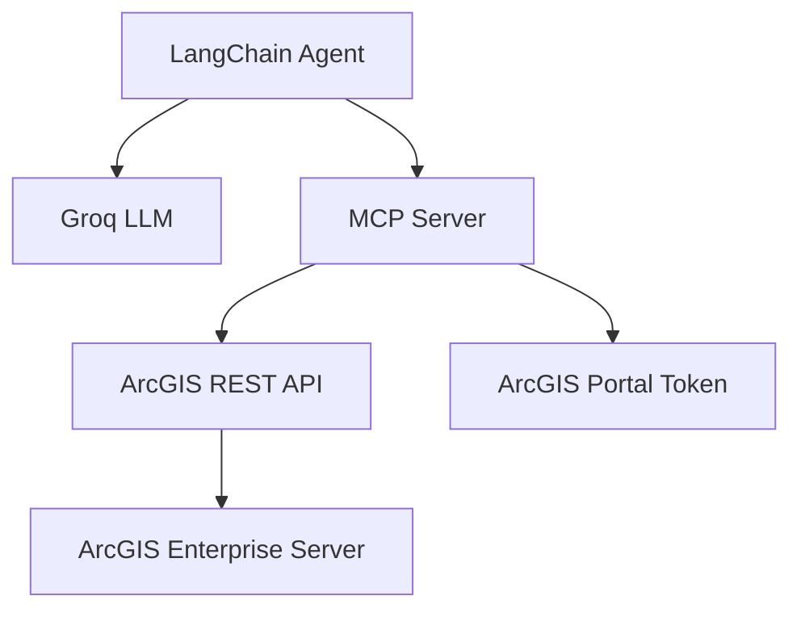
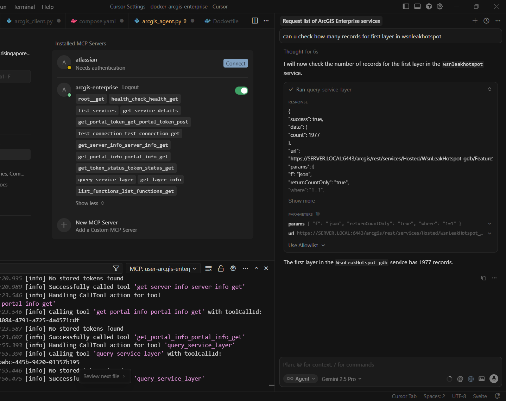

# Docker ArcGIS Enterprise with AI Agent

> AI-Powered ArcGIS Enterprise - Natural language interaction with ArcGIS Enterprise using LangChain and MCP.


## Overview

Extends [docker-arcgis-enterprise](https://github.com/Wildsong/docker-arcgis-enterprise) with AI capabilities, enabling natural language queries to ArcGIS services through LangChain and MCP powered by FastAPI.

## Architecture



## Features

- Natural Language Queries: Ask about ArcGIS services like a chatbot
- Service Discovery: Automatically list and find hosted services
- Service Details: Get published service information like layers and extents
- Query Layer: Query layer with parameters such as record counts

## Quick Start

### Setup
For docker ArcGIS Enterprise setup please refer to the [References](#references) section below.

```bash
cd docker-arcgis-enterprise
cp sample.env .env
cp configurebasedeployment.properties.SAMPLE configurebasedeployment.properties
docker-compose up -d
```

## Usage Examples

### List Services

```bash
curl -X POST http://localhost:8000/chat \
  -H "Content-Type: application/json" \
  -d '{"message": "What services are available in ArcGIS Server?"}'
```


### Get Service Details

```bash
curl -X POST http://localhost:8000/chat \
  -H "Content-Type: application/json" \
  -d '{"message": "Is there a service called TouristAttractions?"}'
```


### Cursor Integration

To enable tool discovery in Cursor, copy the contents of `mcp/mcp.json.example` to `~/.cursor/mcp.json`.



## Endpoints

- Frontend: http://localhost:3000
- AI Agent: http://localhost:8000/chat
- MCP Server: http://localhost:8001
- ArcGIS Portal: https://portal.local:7443
- ArcGIS Server: https://server.local:6443

## Tech Stack

- LLM Agent: LangChain + Groq Llama 3.1 8B
- MCP: FastAPI with Model Context Protocol
- ArcGIS: Enterprise 11.4 (Server, Portal, DataStore)
- Database: PostgreSQL with PostGIS extension

## References

- Docker Issues: Refer to [docs/README.md](docs/README.md) for detailed Docker setup, configuration and troubleshooting
- General Troubleshooting: See [docs/README-original.md](docs/README-original.md) for Wildsong's comprehensive explainations
---

Ready to explore ArcGIS Enterprise with AI? 🚀
